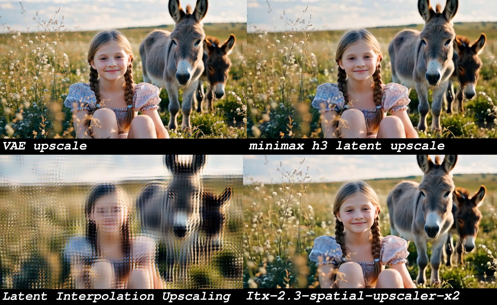

<p align="center">
  <a href="./README.md">English</a> ·
  <a href="./README_zh.md"><strong>中文</strong></a>
</p>

<div align="center">

# ComfyUI Minimax H3 Latent Upscaler

**Minimax H3 视频生成专用 Latent 神经网络放大节点**
学习型 · 高保真 · 2D 与 3D 双版本

</div>

一个 ComfyUI 自定义节点，用训练好的神经网络（而非简单插值）对 **Minimax H3** 的 VAE latent
（24 通道）进行放大。它的**主要目的是加速高分辨率视频的生成**，并提升画质：

- **跳过「解码 → 像素放大 → 再编码」的慢速往返。** Minimax H3 自带约 5B 参数的笨重 VAE，
  对 latent 做解码和再编码都很耗时；直接在 latent 空间放大，就彻底省掉了这一往返开销。
- **支持更快的生成流程：** 先低分辨率生成（latent token 少得多），用本节点放大 latent，再在
  目标分辨率下二次采样 / 重绘精修。

同时，它**避免了直接对 latent 插值（双线性/双三次）带来的鬼影、重影问题**，作用类似于
**LTX2.3** 中的 latent 放大模型。

⚠️ 它节省的是**时间，不是显存** —— 精修阶段仍在目标分辨率下运行，峰值显存与直接高清生成接近，
收益纯粹是更快出片。

提供三种选择输出尺寸的方式，均注册在 `video/MinimaxH3` 分类下：

**按放大倍数**（原版节点）：
- **Minimax H3 Latent Upscaler (2D)**：2D 残差主干 + 穿插的时序 3D 卷积，仅做空间（H×W）放大，
  时间维度保持不变，轻量且快速。
- **Minimax H3 Latent Upscaler (3D)**：纯 3D 卷积主干（3D 残差块 + 时序卷积 + 三线性插值），
  联合处理时空体，时间一致性更强，但算力/显存开销更高。

**按明确尺寸**（社区补全，纯 3D 主干）：
- **H3 Latent Upscaler (Target Resolution)**：直接填目标像素 `width` / `height`，节点会按可配置的
  网格（8 / 16 / 32 …）对齐 latent 并自动反推放大倍率。适合「我知道确切输出分辨率」的场景。
- **H3 Latent Upscaler (Megapixels)**：填目标总像素（百万像素，例如 `1.2`），保持原宽高比、按网格
  对齐，并自动反推放大倍率。适合「我就想要约 1.2MP」的工作流。
- **H3 Latent Cond Sync (3D)**：纯透传辅助节点（不做放大）。读取当前 latent 尺寸，把 `positive` /
  `negative` 的 `CONDITIONING` 中图像引用同步 resize 到该尺寸，避免第二阶段精修时出现尺寸不匹配。
  放在某个放大节点之后即可。

> 两个「明确尺寸」节点会在内部计算出等效 `scale` 并喂给同一个训练好的模型，因此 1.0×–4.0× 之间
> 任意目标都能用；同时它们保持音频 latent 不被放大。

> 三个放大节点均**只支持放大**（`scale >= 1.0`）。`scale = 1.0` 返回输入原样；`scale < 1.0` 会报错。
> **H3 Latent Cond Sync** 不是放大节点 —— 它只透传 latent 并把 conditioning 同步到对应尺寸。

---

## 📸 示例

**视频放大对比**

<video src="examples/Minimax_h3_latent_Upscaler_001.mp4" controls width="640"></video>

**图像放大对比**



---

## 📁 项目结构

```text
Comfyui_Minimax_h3_latent_Upscaler/
├── examples/
│   ├── Minimax_h3_latent_Upscaler_001.mp4
│   └── Minimax_h3_latent_Upscaler_002.jpg
├── workflow_templates/
│   └── minimax_h3_r2v_Latent Upscaler example workflow.json  # ComfyUI 模板示例工作流
├── nodes/
│   ├── __init__.py                       # 合并全部节点映射
│   ├── minimax_h3_latent_upscaler_2d.py  # 2D 主干 + Temporal 3D Conv（倍数模式）
│   ├── minimax_h3_latent_upscaler_3d.py  # 纯 3D 卷积（倍数模式）
│   ├── h3_upscaler_common.py             # 公共模型加载 + 3D 推理逻辑
│   ├── H3_latent_upscaler_resolution.py  # 按目标分辨率节点（社区）
│   ├── H3_latent_upscaler_megapixels.py  # 按百万像素节点（社区）
│   ├── H3_latent_upscaler_3d_v3.py       # Cond Sync 透传：把 CONDITIONING 同步到 latent 尺寸（社区）
│   └── H3LatentResize.py                 # 共享的 conditioning resize 辅助函数
├── README.md
├── README_zh.md
└── __init__.py
```

> 模型权重**不**随仓库提供，请按下方「模型放置」说明放入 ComfyUI 模型目录。

---

## 🚀 核心特性

- ✅ **学习型 latent 放大** — 针对 Minimax H3 latent 训练的神经网络，比双线性/双三次插值清晰得多。
- ✅ **两种主干** — 追求速度选轻量的 **2D** 版，追求时间一致性选 **3D** 版。
- ✅ **任意倍数 1.0×–4.0×** — `scale` 连续可调，步进 0.1（默认 2.0）。
- ✅ **24 通道 Minimax H3 latent** — 使用训练时一致的逐通道均值/标准差做归一化。
- ✅ **自动识别模型结构** — 直接从权重读取通道数、块数、时序配置与卷积核大小，无需手动配置。
- ✅ **鲁棒的权重加载器** — 支持 `.safetensors` 与 `.pth`；自动 FP8→FP16；兼容合并权重中的
  `upscaler.` 前缀。
- ✅ **可选精度与设备** — `cuda`/`cpu` 与 fp32/fp16/bf16 选项。
- ✅ **即插即用** — 标准 ComfyUI 节点，不改变现有工作流。

推理时强制关闭注意力（`attn=False`）以提升速度与稳定性；已加载模型按 `(名称, 设备, 精度)`
缓存，重复调用开销很低。

---

## 📦 安装

1. 将仓库克隆到 ComfyUI 的 `custom_nodes` 文件夹：

   ```bash
   cd ComfyUI/custom_nodes
   git clone https://github.com/LBH-123-AI/Comfyui_Minimax_h3_latent_Upscaler.git
   ```

2. 所需依赖（`torch`、`einops`、`safetensors`）在标准 ComfyUI 环境中已自带，无需额外安装。

3. 重启 ComfyUI。

---

## 🤖 模型放置

节点从这里扫描并加载权重：

```text
ComfyUI/models/latent_upscale_models/
```

把你的 Minimax H3 latent 放大模型权重（`.safetensors` 或 `.pth`）放进该目录，节点下拉框会自动列出。

预训练权重可在此下载：
[huggingface.co/LBH-123-AI/Minimax_h3_latent_Upscaler](https://huggingface.co/LBH-123-AI/Minimax_h3_latent_Upscaler)

加载器会自动识别结构，只要权重存储的结构匹配，2D 与 3D 节点可共用同一份权重。

---

## 🧩 使用方法

从 `video/MinimaxH3` 菜单中添加所需节点，连入一个 `LATENT`，选择模型、设置缩放模式/参数，再解码即可。

**典型流程：**
- **快速预览：** `[Minimax H3 Latent] → [H3 Latent Upscaler] → [VAE 解码]`
- **高品质 / 省时（推荐）：** `[低清 Latent] → [H3 Latent Upscaler] → [二次采样重绘/精修] → [VAE 解码]`

相比「[Latent] → [VAE 解码] → [像素放大] → [VAE 编码] → …」这种朴素做法，直接在 latent 空间
放大跳过了昂贵的 VAE 解码/编码往返。Minimax H3 的约 5B 参数 VAE 让解码与再编码都明显偏慢，时间
主要就省在这里。同时也避免了直接对 latent 插值（双线性/双三次）造成的**鬼影 / 重影**问题。

⚠️ **省时间，不省显存：** 精修仍在目标分辨率下运行，峰值显存与直接高清生成接近，收益纯粹是更快出片。

### 节点参数 — 2D / 3D（经典）

| 参数 | 类型 | 默认值 | 范围 / 选项 | 说明 |
| :--- | :--- | :--- | :--- | :--- |
| `latent` | LATENT | — | — | 输入的 Minimax H3 latent（(B,C,T,H,W) 或 (B,C,H,W)） |
| `model_name` | 下拉框 | 自动 | 扫描到的文件 | `latent_upscale_models/` 中的模型 |
| `scale` | FLOAT | 2.0 | 1.0 – 4.0（步进 0.1） | 空间放大倍数 |
| `device` | 下拉框 | cuda | cuda / cpu | 推理设备 |
| `precision` | 下拉框 | fp32 | fp32 / fp16 / bf16 | 推理精度。fp16/bf16 显存占用更低、速度更快，fp32 最精确 |

**输出：** `LATENT` — 放大后的 latent，可直接送 VAE 解码。

### 节点参数 — Target Resolution（3D，社区）

| 参数 | 类型 | 默认值 | 范围 / 选项 | 说明 |
| :--- | :--- | :--- | :--- | :--- |
| `latent` | LATENT | — | — | 输入的 Minimax H3 latent（(B,C,T,H,W) 或 (B,C,H,W)） |
| `model_name` | 下拉框 | 自动 | 扫描到的文件 | `latent_upscale_models/` 中的模型 |
| `width` | INT | 768 | ≥ 1 | 目标像素**宽** |
| `height` | INT | 432 | ≥ 1 | 目标像素**高** |
| `align` | INT | 16 | 2,4,6,…（步进 2） | latent 网格整除数（8/16/32…），目标 latent 的 H×W 会向上取整到 `align` 的倍数 |
| `device` | 下拉框 | cuda | cuda / cpu | 推理设备 |
| `precision` | 下拉框 | fp32 | fp32 / fp16 / bf16 | 推理精度 |

**输出：** `LATENT` — 放大后的 latent。等效倍率由 `width`/`height` 与 `align` 反推得到。

### 节点参数 — Megapixels（3D，社区）

| 参数 | 类型 | 默认值 | 范围 / 选项 | 说明 |
| :--- | :--- | :--- | :--- | :--- |
| `latent` | LATENT | — | — | 输入的 Minimax H3 latent（(B,C,T,H,W) 或 (B,C,H,W)） |
| `model_name` | 下拉框 | 自动 | 扫描到的文件 | `latent_upscale_models/` 中的模型 |
| `target_megapixels` | FLOAT | 1.2 | 0.1 – 8.0（步进 0.1） | 目标总百万像素，保持宽高比 |
| `align` | INT | 16 | 2,4,6,…（步进 2） | latent 网格整除数（8/16/32…），目标 latent 的 H×W 会向上取整到 `align` 的倍数 |
| `device` | 下拉框 | cuda | cuda / cpu | 推理设备 |
| `precision` | 下拉框 | fp32 | fp32 / fp16 / bf16 | 推理精度 |

**输出：** `LATENT` — 放大后的 latent。等效倍率由计算出的像素尺寸与 `align` 反推得到。

### 节点参数 — Cond Sync（3D，社区）

| 参数 | 类型 | 默认值 | 范围 / 选项 | 说明 |
| :--- | :--- | :--- | :--- | :--- |
| `latent` | LATENT | — | — | 输入 latent（通常由上游放大节点产出），**原样透传** |
| `positive` | CONDITIONING | 可选 | — | 正条件；其中图像引用会被同步 resize 到 latent 当前尺寸 |
| `negative` | CONDITIONING | 可选 | — | 负条件；其中图像引用会被同步 resize 到 latent 当前尺寸 |

**输出：** `(LATENT, CONDITIONING, CONDITIONING)` — 透传的 latent + 同步后的正/负条件。

> 该节点**不做放大**，仅把 conditioning 同步到 latent 当前分辨率。把它接在某个放大节点之后，
> 第二阶段精修/重采样就能拿到匹配的尺寸。

> **选哪个节点？** 简单 `1.0×–4.0×` 倍率用 **2D / 3D（倍数）**；明确知道输出 WIDTH×HEIGHT 用
> **Target Resolution**；「我就想要约 1.2MP」用 **Megapixels**；放大后需要把 `CONDITIONING` 同步
> resize 给第二阶段精修，用 **Cond Sync**。两个「明确尺寸」节点通过 `h3_upscaler_common.py` 共用同一份模型。

---

## 🧪 模型与架构

- **Latent 格式：** 24 通道 Minimax H3 VAE latent，推理前按训练均值/标准差逐通道归一化，推理后反归一化。
- **默认检测结构**（若权重不同会被自动覆盖）：`in_channels=24`、`in_blocks=12`、
  `out_blocks=12`、`base_channels=512`、`dropout=0.1`、`temporal_every=2`、
  `temporal_kernel=5`、`attn=False`。
- **插值方式：** 2D 节点用双线性特征插值；3D 节点用三线性插值。
- **时间处理：** 两个节点均保持时间长度不变，仅放大空间分辨率（H×W）。

---

## 📊 训练数据

该放大模型在**近 8 万对样本**上训练（低分辨率 latent 与高分辨率目标配对），并在数据类型与缩放倍数上做了均衡，以提升泛化能力。

**按数据类型：**

| 数据类型 | 对数 | 占比 |
| :--- | :--- | :--- |
| 视频素材 | 约 70,000 对 | 约 87.5% |
| 2K 图像 | 约 8,000 对 | 约 10% |

**按缩放倍数（占比，约）：**

| 倍数 | 占比 | 说明 |
| :--- | :--- | :--- |
| 2× | 40% | 主力倍数 —— 最常见的实际使用场景 |
| 1.5× | 10% | — |
| 2.5× | 10% | — |
| 3× | 10% | — |
| 4× | 10% | — |
| 1.0×–4.0×（任意小数位） | 10% | 增强对中间任意倍数的泛化能力 |

重点放在 **2×（40%）**，对应最常见的实际使用场景；而 **1–4 之间的任意小数位占 10%** 这一设计，
是为了避免模型只对固定的 1.5×/2×/2.5×/3×/4× 几个档位过拟合，从而能在推理时处理 1.0×–4.0× 区间内
任意连续 `scale` 值。

---

## 🙏 致谢

本节点沿用了 **Ttl** 提出的「神经网络 latent 放大」思路
（[ComfyUi_NNLatentUpscale](https://github.com/Ttl/ComfyUi_NNLatentUpscale)，
https://github.com/Ttl）。本项目模型架构同时参考借鉴了 **LTX 2.3 Spatial Upscaler**
（`ltx-2.3-spatial-upscaler-x2-1.1.safetensors`）。感谢这些开源工作为本项目奠定基础。
